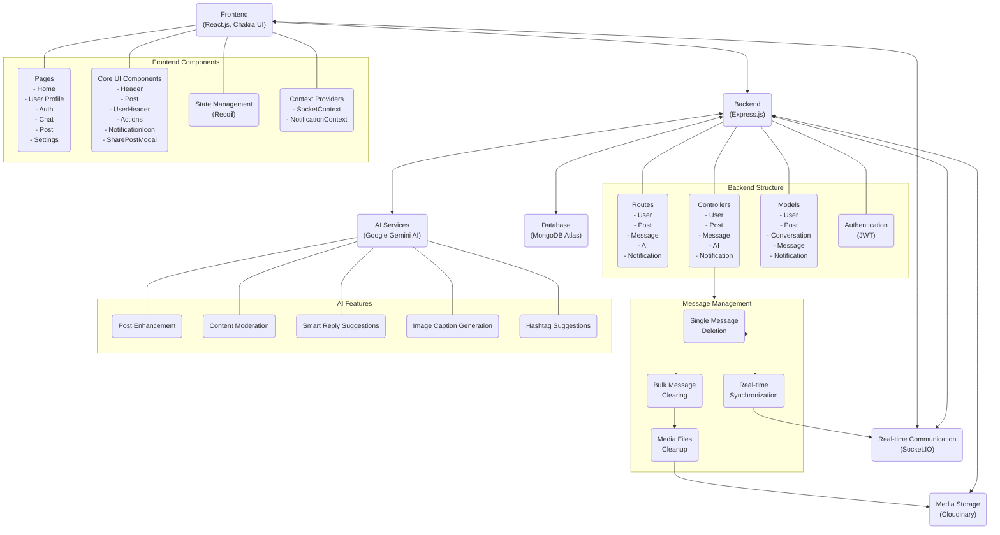
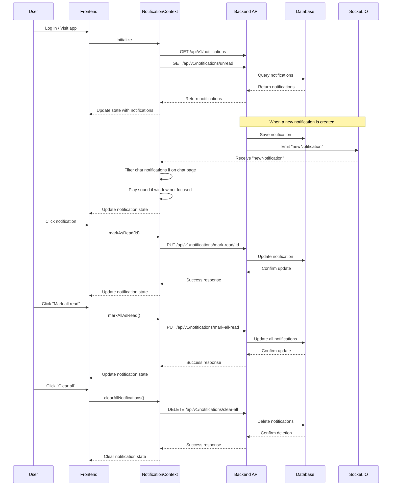
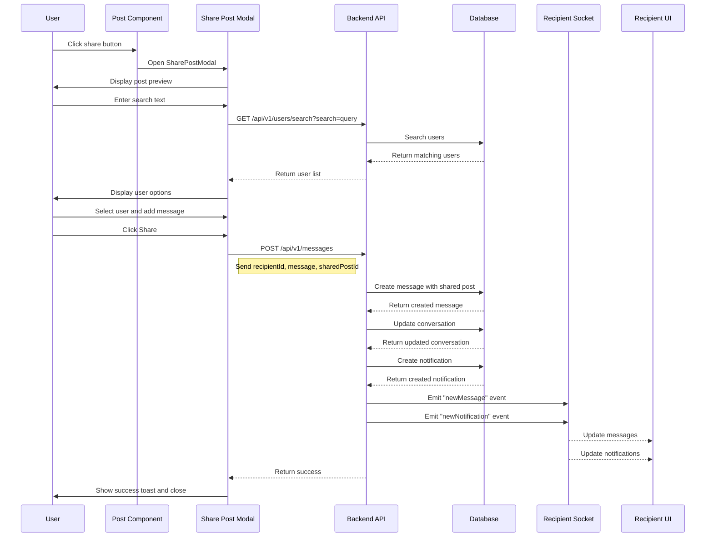
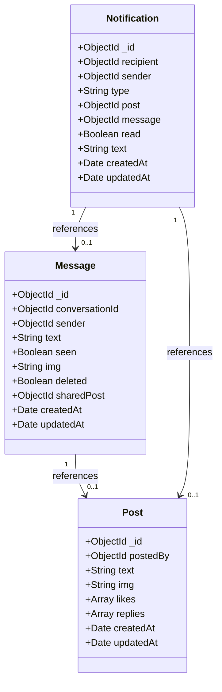
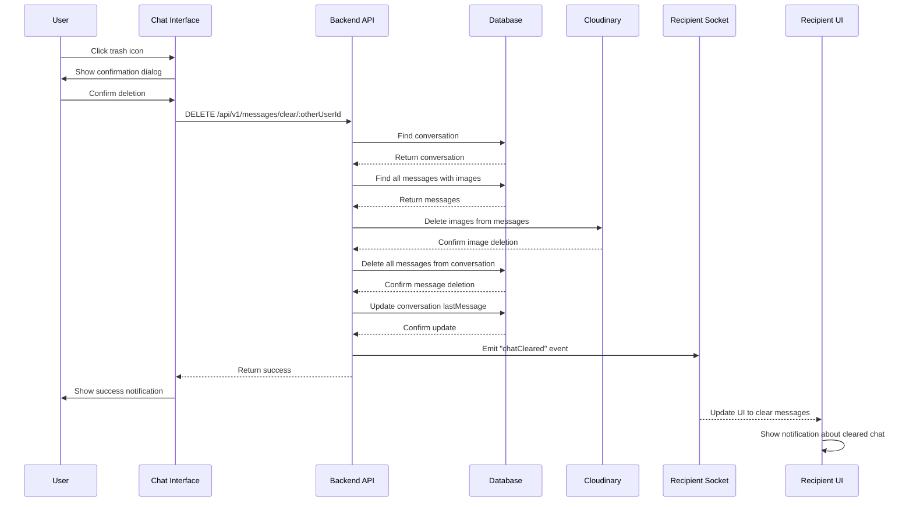

# Threadio Architecture Diagram

## Notification System Diagram

## Post Sharing Flow

## Message Model with Shared Post

## Message Management Flow

## Architecture Overview

Threadio is built on a MERN stack architecture with integrated AI capabilities:

### Core Components

- **Frontend**: React.js with Chakra UI for responsive design
- **Backend**: Express.js server handling API requests and business logic
- **Database**: MongoDB Atlas for data persistence
- **AI**: Google Gemini AI for intelligent features

### Key Features

- **Core Social Features**: Posts, comments, likes, follows, real-time chat
- **Notification System**: Real-time notifications with context-aware filtering and management
- **Post Sharing**: Direct sharing of posts to other users' chats with optional messages
- **Message Management**: Individual message deletion and bulk conversation clearing with media cleanup
- **AI-Enhanced Capabilities**:
  - Post enhancement with suggestions
  - Content moderation for community guidelines
  - Smart reply suggestions in chat
  - Automatic image caption generation
  - Intelligent hashtag recommendations

### Data Flow

- Users interact with the React frontend
- API requests flow to the Express backend
- Data is stored in MongoDB
- AI features enhance content through Gemini AI integration
- Real-time features (chat, notifications) use Socket.IO
- Media assets are stored in Cloudinary

### Notification System

- Notifications are created for various actions (likes, replies, follows, messages, shared posts)
- Context-aware filtering hides chat notifications when on the chat page
- Real-time delivery through Socket.IO
- Comprehensive management with mark as read, mark all as read, and clear all features

### Post Sharing Flow

- Users can share posts directly to another user's chat
- Posts are embedded within messages with preview capabilities
- Shared posts maintain links to original content
- Recipients receive real-time notifications about shared posts

### Message Management System

- Individual messages can be deleted with "This message was deleted" indicator
- Entire conversations can be cleared with a single action
- All associated media files are automatically removed from Cloudinary
- Real-time synchronization ensures both users see consistent state
- Confirmation dialogs prevent accidental data loss
