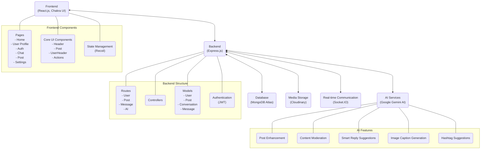

# Threadio Architecture Diagram

## Architecture Overview

Threadio is built on a MERN stack architecture with integrated AI capabilities:

### Core Components
- **Frontend**: React.js with Chakra UI for responsive design
- **Backend**: Express.js server handling API requests and business logic
- **Database**: MongoDB Atlas for data persistence
- **AI**: Google Gemini AI for intelligent features

### Key Features
- **Core Social Features**: Posts, comments, likes, follows, real-time chat
- **AI-Enhanced Capabilities**: 
  - Post enhancement with suggestions
  - Content moderation for community guidelines
  - Smart reply suggestions in chat
  - Automatic image caption generation
  - Intelligent hashtag recommendations

### Data Flow
- Users interact with the React frontend
- API requests flow to the Express backend
- Data is stored in MongoDB
- AI features enhance content through Gemini AI integration
- Real-time features (chat, notifications) use Socket.IO
- Media assets are stored in Cloudinary